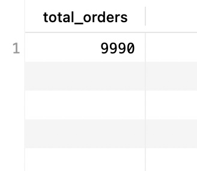
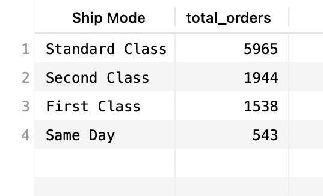
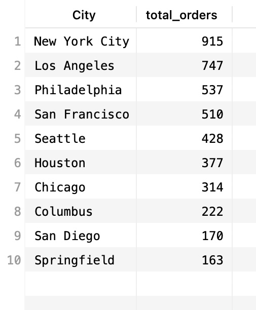
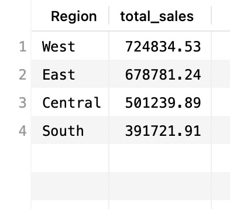
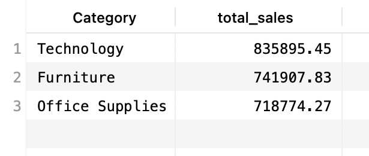

# SuperstoreSQLanalysisProject
SQL analysis on Superstore dataset (sales, customers and performance insights)

## Dataset
- Superstore dataset
- Imported from CSV into MySQL
- Queried using SQL in TablePlus

## Tools Used
- MySQL
- TablePlus

## SQL Queries and Results

### 1) Total Orders

- SQL Query:
```sql
SELECT COUNT(*) AS total_orders
FROM superstore_fixed;
```





- Insight:

The dataset contains 9,990 total orders.


### 2) Orders by Ship Mode

- SQL Query:
```sql
SELECT `Ship Mode`, COUNT(*) AS total_orders
FROM superstore_fixed
GROUP BY `Ship Mode`
ORDER BY total_orders DESC;
```





- Insight:

Standard Class is the most frequently used shipping method.


### 3) Top 10 Cities by Number of Orders

- SQL Query:
```sql
SELECT City, COUNT(*) AS total_orders
FROM superstore_fixed
GROUP BY City
ORDER BY total_orders DESC
LIMIT 10;
```





- Insight:

New York City has the highest number of orders, followed by Los Angeles and Philadelphia.


### 4) Sales by Region

- SQLQuery:
```sql
SELECT Region, SUM(Sales) AS total_sales
FROM superstore_fixed
GROUP BY Region
ORDER BY total_sales DESC;
```





- Insight:

The West region generates the highest total sales, followed by the East region.


### 5) Sales by Category

- SQL Query:
```sql
SELECT Category, SUM(Sales) AS total_sales
FROM superstore_fixed
GROUP BY Category
ORDER BY total_sales DESC;
```





- Insight:

Technology has the highest total sales among all categories.
